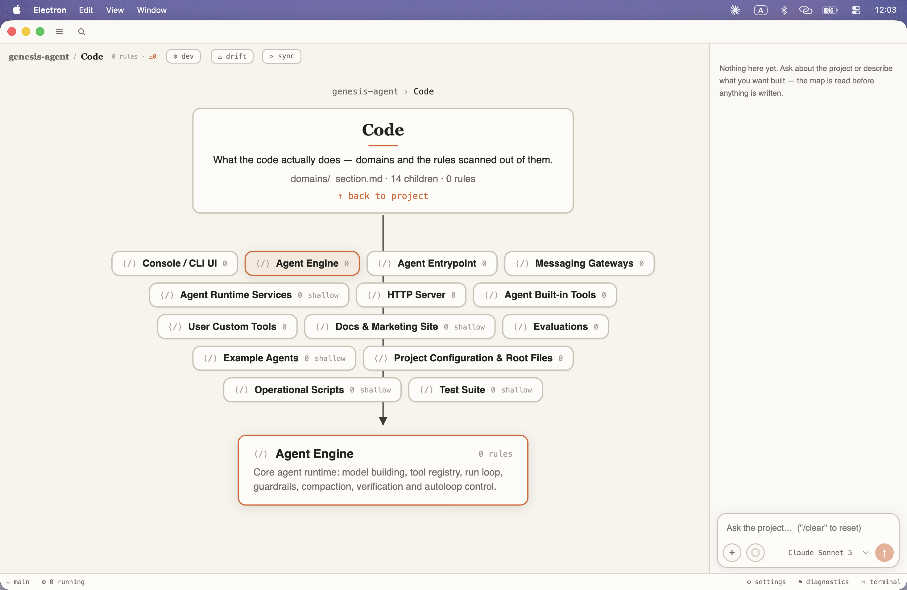

# Alethic

A spec-driven development IDE where a map of your project's logic is the primary surface and the code is its artifact.

Most tools treat code as the truth and documentation as a copy that rots. Alethic inverts that: the `.alethic/` spec is the source of truth, the code is a derived artifact, and the two are reconciled continuously. What you look at is a Minto pyramid of what the project _does_ — features, what each is responsible for, how it is built, what it guarantees — with every node anchored to real symbols in real files.

[](LICENSE)



## Requirements

|                   |                                                                                                                            |
| ----------------- | -------------------------------------------------------------------------------------------------------------------------- |
| **Node.js**       | 22.13 or newer (the pinned pnpm needs `node:sqlite`)                                                                       |
| **pnpm**          | installed for you by `corepack enable`                                                                                     |
| **git**           | used for drift detection and the Git panel                                                                                 |
| **Claude access** | a [Claude Code](https://claude.com/claude-code) login (`claude auth login`) **or** `ANTHROPIC_API_KEY` in your environment |

The last one is the real prerequisite. Alethic drives a live Claude session — without it the app builds and starts, and then cannot do anything.

## Quick start

```bash
git clone https://github.com/ysz7/Alethic.git
cd Alethic
corepack enable
pnpm install
pnpm doctor     # checks node, pnpm, git, dependencies and model access
pnpm dev
```

`pnpm doctor` tells you exactly what is missing and how to fix it. When it is green, `pnpm dev` opens the app.

## Commands

| Command            | What it does                                                                          |
| ------------------ | ------------------------------------------------------------------------------------- |
| `pnpm dev`         | Run the desktop app with hot reload                                                   |
| `pnpm doctor`      | Preflight: runtime, package manager, git, dependencies, model access                  |
| `pnpm build`       | Type-check and build the app bundle                                                   |
| `pnpm dist`        | Package a distributable into `apps/desktop/release/`                                  |
| `pnpm test`        | Unit and integration tests (no model calls, no Electron)                              |
| `pnpm lint`        | ESLint over the workspace                                                             |
| `pnpm format`      | Check formatting with Prettier (`format:write` to fix)                                |
| `pnpm dep:check`   | Enforce the layering rules with dependency-cruiser                                    |
| `pnpm check`       | All five gates: build, test, lint, dep:check, format                                  |
| `pnpm dogfood`     | Live end-to-end scenarios against a real Claude session — costs tokens, takes minutes |
| `pnpm golden:scan` | Score a scan against the golden fixtures                                              |

`pnpm check` is the gate. Nothing lands unless it is green.

## How it works

**Open a repository → it gets scanned.** A deterministic repo map (free, no tokens) proposes domains; you confirm them; agents read the code in each and write **features** — a named capability with a body: what it is responsible for, how it works, where it is used, the invariants it guarantees. Coverage is never traded: a domain that exists in the code cannot be missing from the map.


**The map is a pyramid, not a list.** A container holds 3–7 children and its own card asserts what they have in common. When a feature turns out to hold more than that, it grows a layer inward instead of getting longer — keeping its identity, its history and its links.

**Deepen goes down, not sideways.** Pressing Deepen on a feature re-reads its code and fills in its own body. It does not breed neighbours.


**Plans are one living document.** Phases with checkboxes, executed one at a time; when a phase lands, the system ticks its items and scans the new code back into the map. There is also a plan mode for non-code projects, where the map holds real content instead of rules.


**Drift is caught without an LLM.** Every node is anchored to symbols by a structural hash over a tree-sitter parse, so reformatting and comment edits cost nothing. When the structure actually moves, the node goes `stale` and only then does a Sync agent spend a token judging it — and the verdict names the part of the feature that changed, not just the feature.


**Everything the agent writes goes through validated tools.** Schema, status transitions and the title norm are enforced by the write path, not by asking the model nicely. Human-edited nodes are inviolable — the agent can offer a diff, never overwrite.

## Permissions and safety

Read this before pointing Alethic at a repository you care about.

Alethic runs an agent that **writes files and runs shell commands in your project**. That is the point of it, and it is also the risk:

- Each role gets only the tools it needs. The Navigator is read-only. The Scanner cannot write code, only spec.
- The first file write and the first shell command in a session **ask you**, with three answers: allow once, deny, or allow for this session. Granted permissions are listed in Settings and can be revoked.
- There is an opt-in _auto-accept edits_ mode. It covers edits only — commands still ask every time.
- `.alethic/` is snapshotted before any destructive operation (rescan, deepen, migrate); the last five snapshots are kept in `.alethic/.backup/`.
- Nothing is committed or pushed on your behalf.

Your code and prompts go to Anthropic's API, under whatever terms your Claude account carries. Alethic itself collects nothing and phones nowhere.

## Project layout

```
apps/desktop/       Electron shell — main process services, React renderer
packages/format/    The .alethic/ format: schema, anchors, drift, validator
packages/agent/     Agent roles, prompts, the MCP write tools, the SDK engine
packages/scan/      Language-independent repo map and symbol extraction
packages/ipc/       The typed contract between main and renderer
fixtures/           Reference maps and golden repos used by the tests
```

Three rules hold the layering together, enforced by `pnpm dep:check`: imports only point downward, `packages/*` never know about Electron, and types come from `@alethic/format` — defined once, never duplicated.

The format itself is documented in code rather than prose: `packages/format` is the single definition of what a `.alethic/` node is — schema, status machine, anchors, drift, validator — and the doc comments there carry the reasoning behind each decision.

## Status

Under active development, built in the open. The core loop — scan, deepen, plan, execute, sync — works end to end and is exercised by live scenarios (`pnpm dogfood`). Packaging, onboarding and signed installers are in progress. Expect rough edges; issues and reports are welcome.

## License

[Apache-2.0](LICENSE).

Fork it, use it commercially, build on it. "Alethic" and its logo are trademarks and are not covered by the licence (Apache-2.0, section 6) — ship your fork under a different name.
